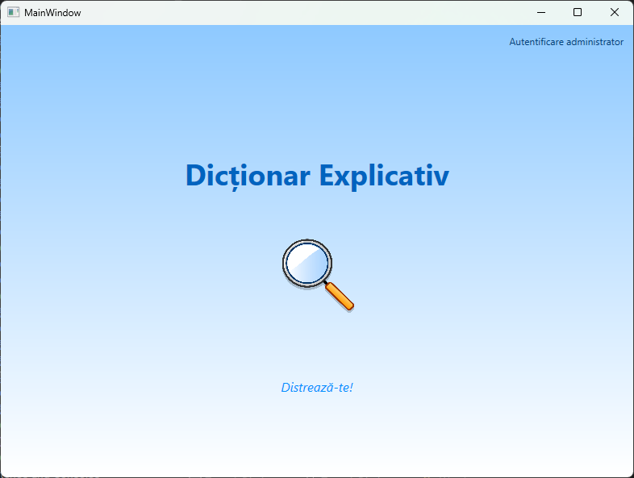
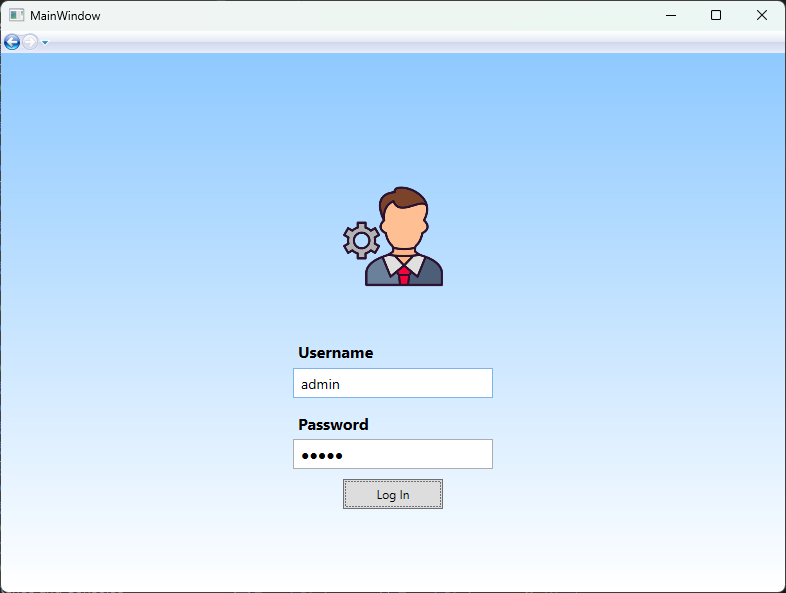
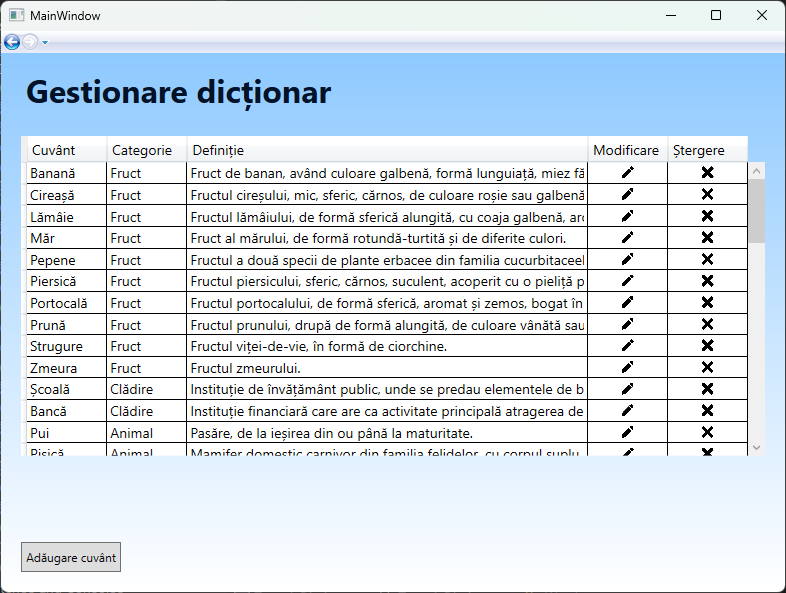
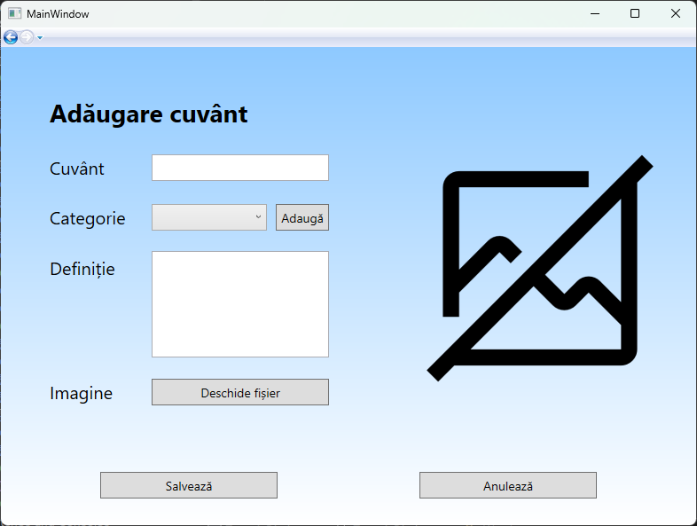
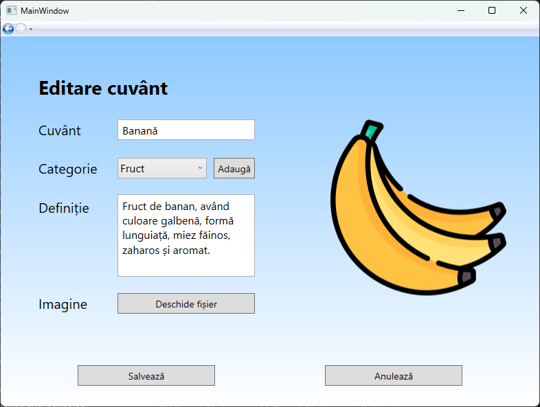
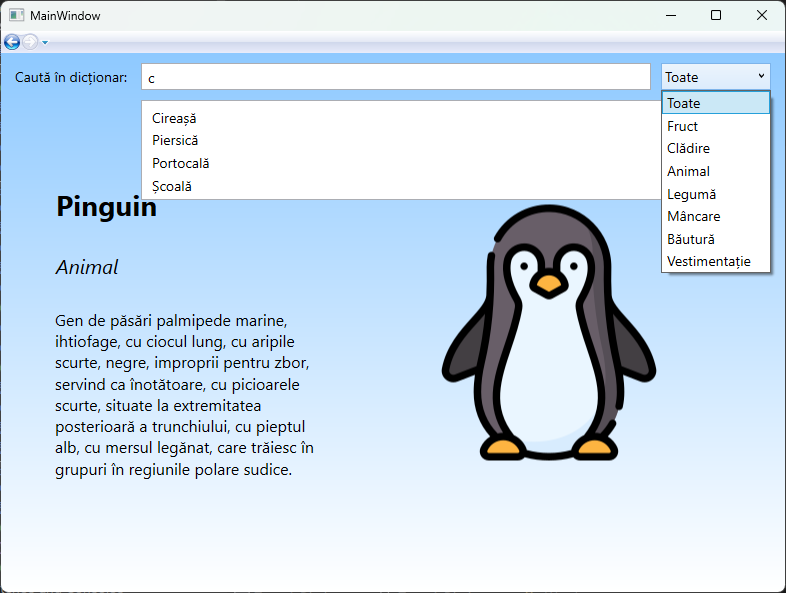
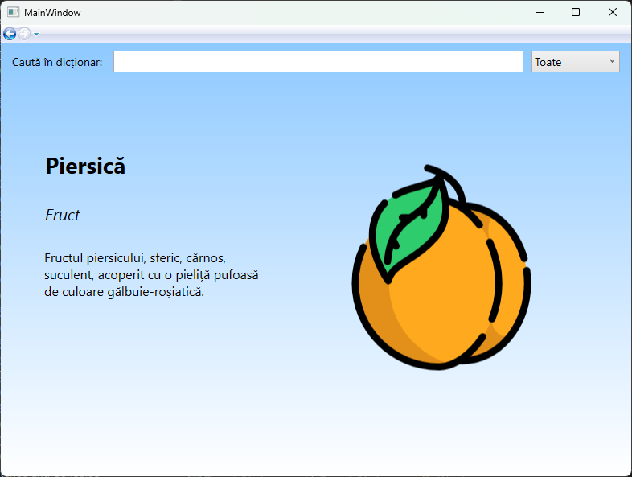
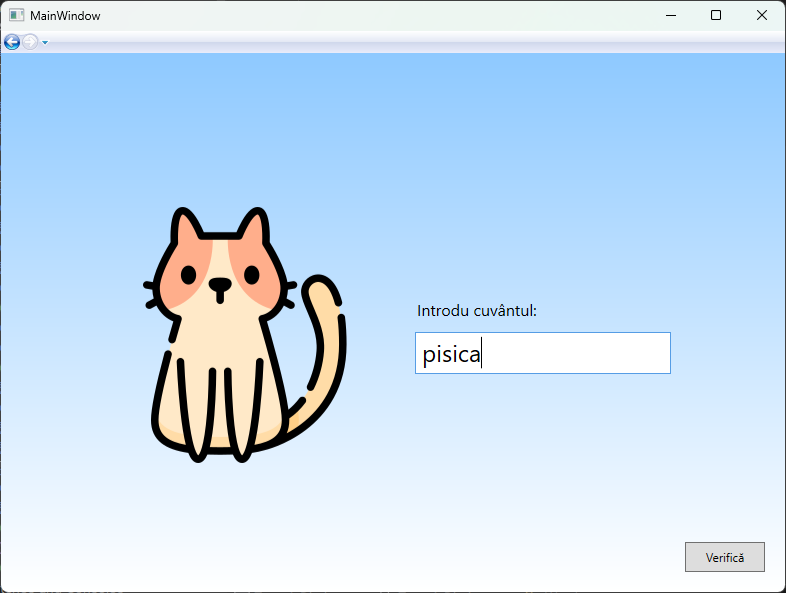

# Interactive Dictionary WPF Application

## Overview

The Interactive Dictionary WPF Application is a desktop application developed using C# and WPF (.NET Framework) for the Visual Programming Environments Course at the faculty. The application is designed to provide users with a comprehensive dictionary experience, including administrative functionalities, word search capabilities, and entertainment features.

## Features

### Administrative Module

- **User Authentication**: Requires a username and password to access the administrative module. User accounts are stored in a predefined text file.
- **Word Management**: Allows users to add, edit, and delete words from the dictionary. Each word includes a description, category, and optional image. Words are stored in a text file with a custom format.
- **Category Management**: Enables the addition of new categories for organizing words.

    
    
    
    

### Word Search Module

- **Category-based Search**: Users can search for words within a specific category selected from a dropdown menu.
- **Keyword Search**: Provides a textbox with autocomplete functionality for searching words by keyword.
- **Word Details**: Displays the selected word, its description, category, and associated image (if available).

    
    

### Entertainment Module

- **Word Guessing Game**: Challenges users to guess five words from the dictionary. Each word is accompanied by either its description or image, displayed randomly.
- **Interactive Gameplay**: Allows users to navigate between words using "Next" and "Previous" buttons. After guessing all five words, users receive feedback on the number of correct answers.

    

## Development Details

- **Technologies Used**: C#, WPF (.NET Framework)
- **User Interface**: Utilizes WPF controls for creating a visually appealing and interactive user interface.
- **Data Management**: Implements file-based storage for user accounts, word definitions, and images.
- **Game Logic**: Implements random word selection and clue display for the entertainment module.

## Setup and Usage

To run the Interactive Dictionary WPF Application, follow these steps:

1. Clone the repository or download the application source code.
2. Open the project in Visual Studio or any compatible IDE.
3. Build the solution to resolve dependencies.
4. Run the application from the IDE or by executing the compiled executable.

## Contributing

Contributions to the project are welcome! If you encounter any issues or have suggestions for improvements, feel free to submit a pull request or open an issue on the GitHub repository.

## Credits and Resources

- Developed by Cezar Constăndoiu
- Icons made by [Freepik](https://www.freepik.com) from [here](https://www.freepik.com/author/freepik/icons/special-lineal-color_15?t=f).

## License

This project is not licensed and comes with no warranty or guarantee of any kind. You are free to view and fork the code for personal and educational purposes.

Happy exploring with the Interactive Dictionary WPF Application! 📚🔍
